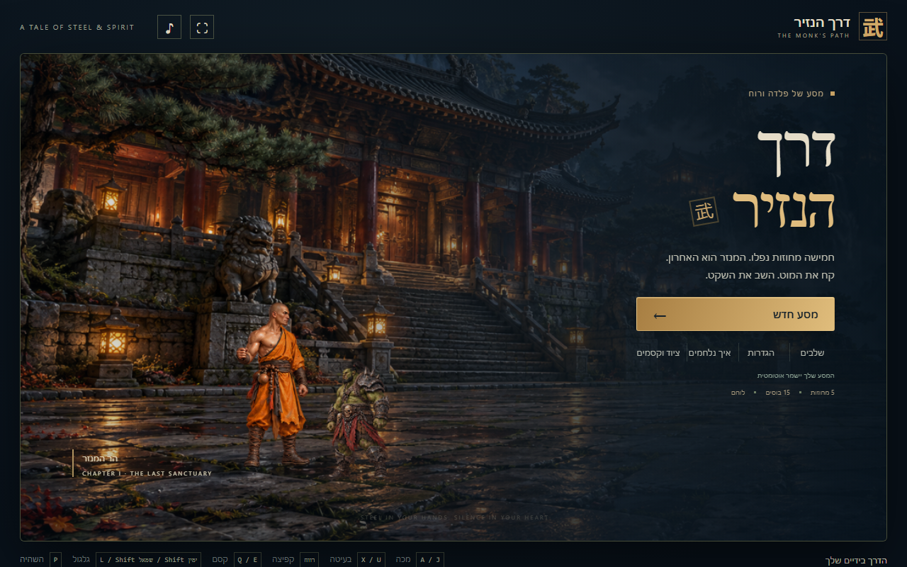
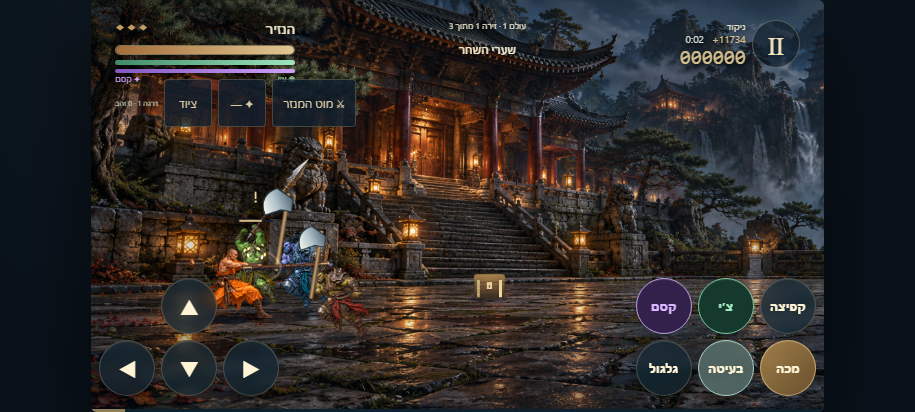
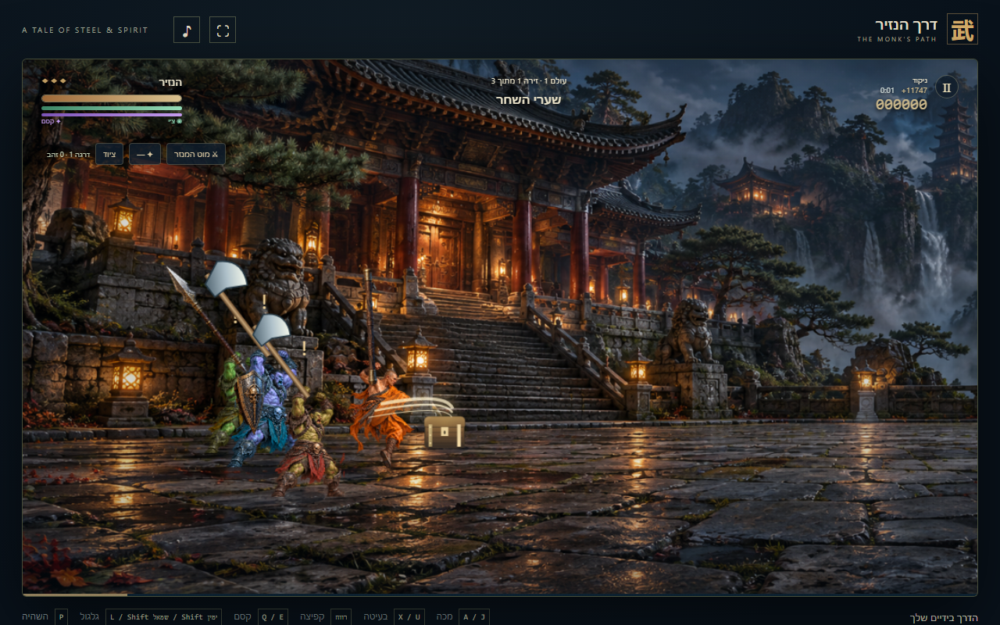

# דרך הנזיר

**[שחקו בדפדפן](https://3dfx40.github.io/monks-path/)** · **[הורידו APK חתום](https://github.com/3dFx40/monks-path/releases/latest)** · **[עמוד שיתוף והוראות](https://3dfx40.github.io/monks-path/share.html)**

משחק מכות מקורי לנייד ולמחשב: נזיר מול אורקים, עם דמויות מפורטות, חמישה רקעים קולנועיים, נשקים, קסמים וקומבואים. כל האמנות נטענת מהתיקייה המקומית; אין שירות חיצוני בזמן המשחק.







## Android ושיתוף

הורידו את `monks-path-1.0.3.apk` מעמוד ההפצות ופתחו בנייד. אם נדרש, אשרו התקנה ממקור זה בהגדרות Android. האפליקציה חתומה במפתח הפצה פרטי, עובדת ללא אינטרנט ומיועדת ל־Android 8.0 ומעלה. שמירה מקומית נשארת בעדכון שמותקן מעל הגרסה הקיימת; הסרה מוחקת אותה. [הוראות התקנה, בנייה וחתימה](docs/ANDROID.md).

לשיתוף שלחו את [עמוד המשחק](https://3dfx40.github.io/monks-path/share.html): הוא כולל הפעלה בדפדפן, הורדת APK, הסברים וצילומי מסך. קישור ה־WEB עובד גם במחשב וגם בנייד, ללא התקנה וללא צורך במחשב אחר באותה רשת.

## הפעלה

ב־Windows לחצו פעמיים על `Start-game.cmd` (נדרש Node.js), או הריצו `node server.cjs` ופתחו `http://localhost:5173`.

בטלפון: חברו את המחשב והטלפון לאותה רשת Wi-Fi ופתחו את כתובת `Mobile, same Wi-Fi` שמודפסת בחלון ההפעלה. החלון צריך להישאר פתוח בזמן המשחק. אפשר גם לפתוח את `index.html` ישירות במחשב.

## שליטה

- בנייד: חיצי מגע ושישה כפתורים — מכה, בעיטה, קפיצה, גלגול, קסם וצ׳י. כפתורי הקרב בגודל 48–56 פיקסלים; גם התפריטים והציוד מותאמים לאצבעות גדולות. אפשר להחזיק כמה כפתורים יחד. נוח במיוחד במצב אופקי.
- במחשב: חיצים או W/S/D לתנועה; A/J למכה; X/U לבעיטה; רווח לקפיצה; L/Shift לגלגול; Q/E לקסם המצויד; B/K למכת צ׳י; C להחלפת נשק; V להחלפת קסם; P להשהיה; F למסך מלא.
- לחיצה על הנשק או הקסם בשורת הציוד מחליפה ביניהם. תפריט הציוד מציג את כל הפריטים שנאספו ומאפשר לצייד אותם.
- קסמים צורכים את מד הקסם הסגול, שמתמלא עם הזמן. צ׳י מפעיל גל הדף נפרד. בקבוקונים משקמים צ׳י, ומזון משקם חיים. הגלגול מעניק חסינות קצרה ומתאושש אחרי 1.15 שניות.
- סימן קריאה מעל אויב מזהיר לפני התקיפה. אחרי חיסול מארב, המשיכו ימינה לפי החץ. בכל זירה ארבעה מארבים ובוס בסופה.

## קומבואים

בצעו שלוש פעולות בתוך חלון של 1.7 שניות, תוך שמירה על קצב ההתקפות. מדריך הלחימה בתפריט מפרט את הרצפים.

| רצף | קומבו |
| --- | --- |
| מכה, מכה, בעיטה | עקב הדרקון |
| מכה, בעיטה, מכה | מערבולת המוט |
| בעיטה, מכה, בעיטה | סופת הלוטוס |
| בעיטה, בעיטה, מכה | שובר השריון |
| מכה, מכה, מכה | שלוש נשימות |
| בעיטה בקפיצה | בעיטת השמיים |
| מכה מיד אחרי גלגול | מכת הצל |

## חמישה עולמות, 15 זירות ו־15 בוסים

כל עולם מחולק לשלוש זירות ארוכות, באורך 4,400–5,680 יחידות משחק. כל זירה מסתיימת בבוס בעל דפוס קרב משלו.

| עולם | זירות | בוסים |
| --- | --- | --- |
| הר המנזר | שערי השחר, גשר הפעמונים, החצר האסורה | בורוק, רוקאר, אזק |
| יער הלחישות | שביל הציידים, ביצת הרעל, לב הבמבוק | גריש, מורגה, ניבאל |
| מכרות הברזל | מנהרת הקריסטלים, הכבשן העתיק, אולם המכונות | קראג, דורן, מאגור |
| מצודת האורקים | חומות המצודה, מחנה המלחמה, כס הפיקוד | וראק, רוגאש, תארוק |
| לב האפר | שדה המטאורים, מקדש הלהבות, כתר האפר | זול, אשאר, גול־מאר |

כוחות הבוסים כוללים הסתערויות, מטחי חצים, זימון אורקים, רעל, כפור, מגן, מוקשים, משיכה מגנטית, ברקים, מטאורים ואש. הם בוחרים תקיפה לפי המרחק, הלחץ של השחקן והתגבורת בזירה, ונמנעים מחזרה מיידית על אותה תקיפה. לכל בוס שלושה שלבי קרב לפי החיים שנותרו, עם קצב הולך וגובר. אויבים ובוסים עולים עד דרגה 5 לאורך המסע. אזהרות על הקרקע וחלונות התאוששות מאפשרים להתחמק ולהכות בחזרה.

## אויבים וציוד

- שבעה סוגי אורקים: לוחם גרזן, סייר, בריון, נושא מגן, קשת, שמאן וברסרקר. כל סוג מופיע בחמש דרגות שמשנות חיים, מהירות ונזק. קשתים שומרים מרחק, שמאנים מרפאים, וברסרקרים מתחזקים כשהם פצועים.
- חמישה נשקים: מוט, חנית, שרשרת, מוט גחלת ופטיש. הטווח, הנזק ומהירות התקיפה משתנים; גחלת מציתה, ופטיש ובעיטות שוברים מגן.
- ארבעה קסמים שנאספים מתיבות: אש עם נזק מתמשך, כפור שמאט, ברק שפוגע בכמה אויבים ומגן אדמה שסופג נזק. איסוף חוזר משדרג קסם עד דרגה שלוש.
- תיבות שבירות, ריפוי, צ׳י, זהב וחפצים זמניים שמגבירים כוח או מהירות. ניסיון מקרבות מעלה את דרגת הנזיר עד 12 ומשפר חיים ונזק. הזהב נספר; אין כרגע חנות.

## תפריט, קושי ושמירה

התפריט כולל מסע חדש, המשך, מפת עולמות וזירות, ציוד, הגדרות ומדריך לחימה. זירות נפתחות לפי ההתקדמות. יש שלוש רמות קושי: מסע, לוחם ומאסטר.

שמירה אוטומטית מתבצעת כל שתי שניות, בהשהיה, בתחילת זירה ובסגירת העמוד. היא שומרת את מיקום הנזיר, חיים, צ׳י, אויבים, תיבות, התקפות פעילות, ציוד, דרגות קסמים וניסיון. הנשקים והקסמים ממשיכים עם הנזיר בין זירות. התקדמות מהגרסה הקודמת מועברת למבנה החדש.

הגיבור מתחיל עם 120 חיים. אחרי השלמת שלוש הזירות של עולם נשמרת אוטומטית נקודת הכניסה לעולם הבא. כשנגמרות כל הפסילות, חוזרים לתחילת העולם הנוכחי עם חיים מלאים ופסילות מחודשות, והציוד, הדרגה והניקוד שהיו בכניסה אליו. השלל והניקוד שנאספו בניסיון שנכשל חוזרים לערכי נקודת השמירה. גם בעולם הראשון יש נקודת חזרה. סגירת המשחק במהלך קרב ממשיכה מהשמירה הרגילה, ללא חזרה לתחילת העולם.

השמירה מקומית לדפדפן ולכתובת האתר; היא אינה מסתנכרנת בין מחשב לטלפון. ניקוי נתוני האתר מוחק אותה. מסע חדש או בחירה ישירה של זירה מחליפים את המסע השמור.

## מבנה ובדיקות

`content.js` מגדיר עולמות, זירות, בוסים, אויבים, נשקים וקסמים. `game.js` מפעיל את הקרבות; `art.js` מצייר; `premium.js` מפעיל תפריטים; `style.css`, `premium.css` ו־`expansion.css` מעצבים את הממשק. `server.cjs` הוא שרת מקומי אופציונלי. המשחק אינו תלוי בספריות חיצוניות וניתן לארח אותו בשרת סטטי.

קיימות גרסת דפדפן וגרסת Android ארוזה ב־WebView, עם אותם קובצי משחק. האמנות דו־ממדית; תיעוד המקורות נמצא ב־`assets/ART.md`. אין כרגע גרסת iOS.

בדיקות אוטומטיות השלימו את כל 15 הזירות והבוסים, בדקו את שבעת סוגי האויבים, איסוף כל הנשקים והקסמים, קומבואים, השפעות קסם, שמירה וטעינה ושליטה בכמה נגיעות בו־זמנית. פורטרט ולנדסקייפ נבדקו בהדמיית דפדפן. קיימים `window.render_game_to_text()` ו־`window.advanceTime(ms)` לצורך בדיקות.

### ריצה וניקוד זמן
לחיצה כפולה והחזקה של כיוון מפעילה ריצה במהירות פי 1.7, גם לאחור ובכפתורי המגע. שחרור הכיוון מפסיק ריצה. צ׳י ירוק וקסם סגול משתמשים במאגרים נפרדים. מד הקסם מתחדש עם הזמן וגם באיסוף מגילות.
השעון מודד זמן משחק בזירה ואינו מתקדם בהשהיה. בסיום זירה נוסף בונוס של `floor(12000 / (1 + seconds / 90))`: סיום מהיר יותר מזכה בבונוס גבוה יותר. הזמן נשמר בהמשך משחק ומתאפס בזירה הבאה.

### נשקים ויריבים
האויבים חזקים יותר: 30% יותר חיים וכ־35% יותר נזק בסיסי; הבוסים עם 45% יותר חיים, כ־40% יותר נזק ו־20% פחות זמן בין יכולות. שמירות ישנות מתעדכנות פעם אחת ושומרות על אחוז החיים שנותר.
הנשקים מצוירים בנפרד מהדמויות ועוקבים אחרי היד: חנית בדקירה ארוכה, פטיש במכה כבדה ושוברת מגן, שרשרת מהירה שפוגעת בשטח רחב, ומוט גחלת שמצית. גם נזק וטווח של קומבואים במכת נשק נגזרים מהציוד שביד. אורקים משתמשים בנשק שמתאים לסוג שלהם, וטווח הפגיעה נקבע בהתאם.

## הרצת בדיקות

בדיקות הפיתוח נמצאות ב־`tests`, עם גרסת Playwright נעולה. המשחק עצמו אינו זקוק לתלויות האלה.

```sh
npm ci
npx playwright install chromium
npm start
# בחלון נוסף, כשהשרת פועל בפורט 5173:
npm test
```

הבדיקות מכסות נשקים, קסמים, מגנים, עדכון שמירות, יכולות של כל 15 הבוסים ומסע מלא עם מקלדת ומגע. `npm run screenshots` מעדכן את צילומי המסך בתיעוד. תמונות ותוצאות ביניים נשמרות ב־`output`, שמוחרג מ־Git.
